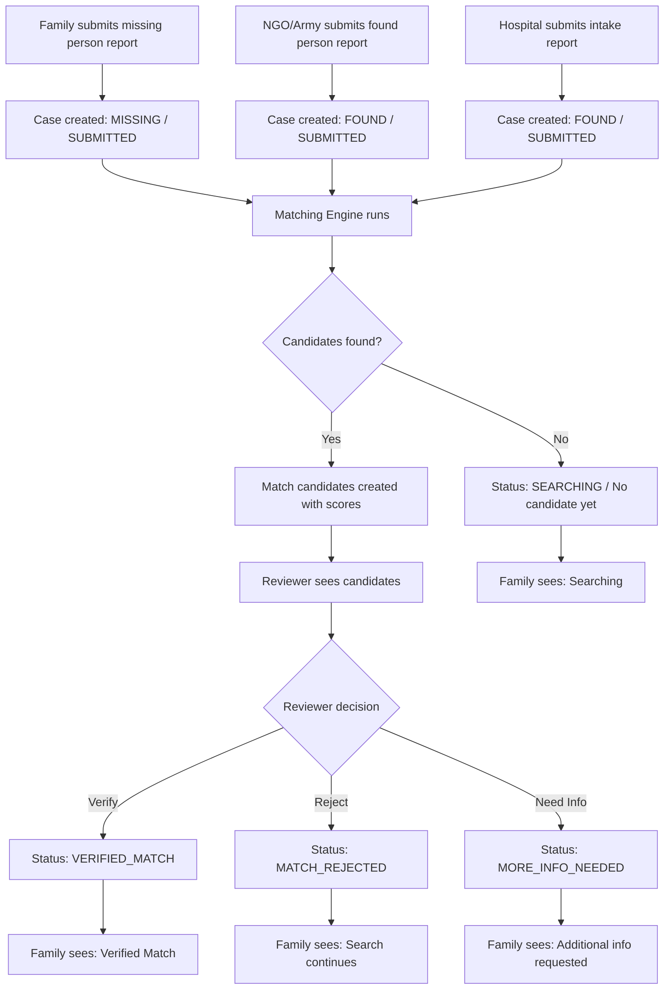
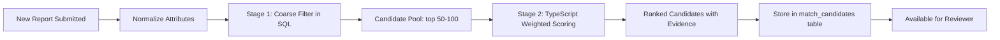
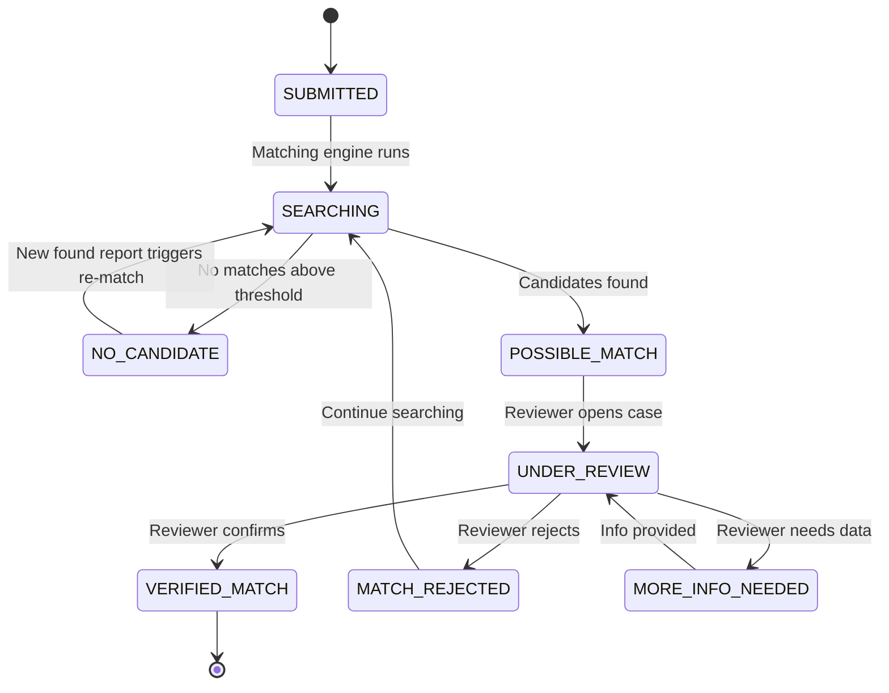
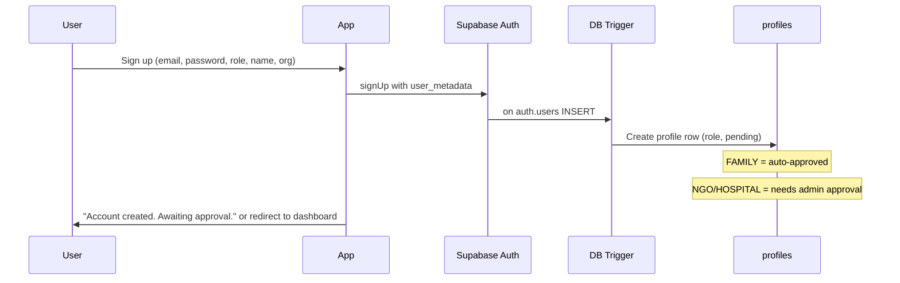
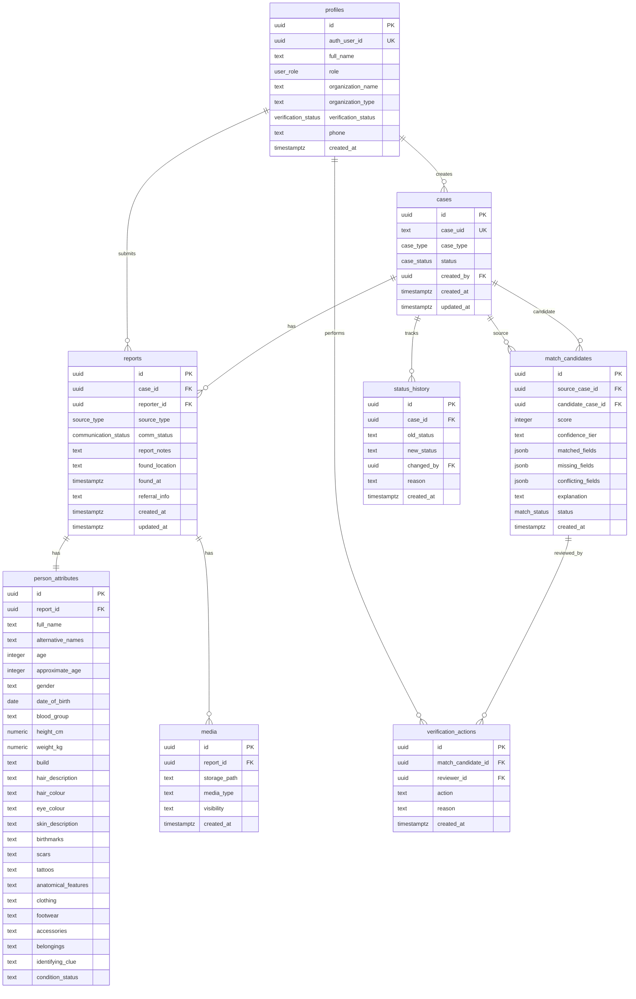

# MILAN — Disaster Missing Person Coordination System
## Complete Implementation Blueprint

---

# 1. EXECUTIVE VERDICT

### Is the idea practical in 5 hours?

**Yes, with aggressive scope control.** The core value proposition — multi-source report intake, fuzzy attribute matching, human verification workflow, and family status view — is achievable by two AI-assisted developers in 5 hours using Supabase + React/Vite.

### What is feasible

| Area | Verdict |
|------|---------|
| Auth + role-based signup | ✅ Fully feasible (~20 min) |
| PostgreSQL schema with all entities | ✅ Fully feasible (~15 min) |
| Family missing-person multi-step form | ✅ Feasible (~45 min) |
| NGO/Army/Rescue found-person form | ✅ Feasible (~30 min) |
| Hospital report form | ✅ Feasible (~20 min) |
| TypeScript weighted matching engine | ✅ Feasible (~45 min) |
| Candidate results with score + evidence | ✅ Feasible (~30 min) |
| Reviewer verify/reject workflow | ✅ Feasible (~20 min) |
| Family status page | ✅ Feasible (~20 min) |
| Row-Level Security (basic) | ✅ Feasible (~15 min) |
| Photo upload to Supabase Storage | ⚠️ P1 — only if time remains |
| Semantic embedding matching | ❌ Skip — not worth setup cost |
| Image/face recognition | ❌ Skip entirely |
| Realtime subscriptions | ⚠️ P1 — simple to add but not core |

### What must be cut/deferred

1. **pgvector / semantic embeddings** — setup overhead exceeds demo value; deterministic matching is explainable and sufficient.
2. **Photo-based matching** — photo *upload* is P1, photo *comparison* is P2. The system must work without photos.
3. **Edge Functions** — not needed. Matching runs in TypeScript. RPC functions in PostgreSQL handle server-side logic.
4. **Realtime subscriptions** — nice for live status updates but not required for demo flow.
5. **Production KYC** — prototype uses role selection at signup + admin approval flag.
6. **Volunteer/public contribution workflow** — P1, only if core flow works.

### Biggest technical risks

1. **RLS misconfiguration** — silent failures return empty data with no error. Mitigation: test every role's access immediately after writing policies.
2. **Form complexity** — multi-step forms for 3 different roles is significant frontend work. Mitigation: share component patterns, keep steps minimal.
3. **Matching engine edge cases** — null handling, weight redistribution, and scoring normalization require careful implementation. Mitigation: use the pre-built TypeScript engine from research.
4. **Time sink on auth/roles** — roles + profiles trigger + RLS can consume 45+ minutes if debugging. Mitigation: use verified SQL scripts from research.

### Confidence level

**HIGH (85%)** — Two AI-assisted developers can deliver a working end-to-end demo scenario if they follow the phase plan strictly and avoid scope creep.

---

# 2. REFINED PROJECT DESCRIPTION

**Milan** is a disaster-time information reconciliation system that collects reports about missing and found/rescued persons from multiple sources (families, NGOs, army/rescue camps, hospitals), performs fuzzy multi-attribute matching to surface candidate connections, and requires human verification before confirming any match.

Milan does **NOT**:
- Physically locate missing persons
- Perform facial recognition
- Prove identity automatically
- Replace government disaster response systems

Milan **DOES**:
- Provide structured intake for missing and found person reports
- Match records using weighted similarity across many attributes (name, age, physical marks, clothing, location, blood group, etc.)
- Work even when the person's name is unknown, their face is unusable, or they cannot communicate
- Surface ranked candidates with explainable evidence for human reviewers
- Give families an honest, transparent status view of their case
- Protect sensitive data (medical, minors) with role-based access
- Consolidate duplicate reports under a single case without deleting source evidence

---

# 3. EXACT MVP SCOPE

## P0 — MUST HAVE (5-hour target)

- [x] Supabase project setup (auth, DB, storage bucket)
- [x] Email/password authentication with role selection
- [x] User profiles with role enum (FAMILY, NGO, ARMY_RESCUE, HOSPITAL, ADMIN)
- [x] Complete PostgreSQL schema (cases, reports, person_attributes, match_candidates, verification_actions, status_history)
- [x] Row-Level Security policies (basic: users see own data, admins see all)
- [x] Family missing-person report (multi-step form)
- [x] NGO/Army/Rescue found-person report (branching form: can/cannot communicate)
- [x] Hospital/clinic report
- [x] Case creation with Milan UID
- [x] TypeScript weighted matching engine with null-safe scoring
- [x] Candidate retrieval and ranking
- [x] Match explanation (matched/missing/conflicting fields)
- [x] Reviewer dashboard: view candidates, verify, reject
- [x] Family status page with case timeline
- [x] Status transitions (SUBMITTED → SEARCHING → POSSIBLE_MATCH → VERIFIED / REJECTED)
- [x] Basic audit/status history
- [x] Seed demo data for both demo scenarios
- [x] Role-based dashboard (different views per role)

## P1 — SHOULD HAVE (if time remains)

- [ ] Photo upload to Supabase Storage
- [ ] Duplicate report linking under same case
- [ ] Controlled public/volunteer contribution (unverified → review → approved)
- [ ] Better fuzzy matching with pg_trgm trigram indexes
- [ ] Realtime status updates via Supabase Realtime
- [ ] Organization entity and verification status
- [ ] Richer match explanation with natural language summary

## P2 — DO NOT BUILD

- [ ] Facial recognition / computer vision
- [ ] Production government KYC
- [ ] SMS / WhatsApp integration
- [ ] Map/GIS integration
- [ ] Custom ML model training
- [ ] pgvector / semantic embeddings
- [ ] Complex notification system
- [ ] Microservices / Kubernetes
- [ ] Multi-language support

---

# 4. COMPLETE USER ROLES

| Role | Code | Can Submit Reports | Can View | Can Verify Matches | Notes |
|------|------|--------------------|----------|-------------------|-------|
| Family | `FAMILY` | Missing person reports | Own cases + own status | No | Primary reporter for missing persons |
| NGO | `NGO` | Found/rescued reports | Own reports + candidate matches | No | Trusted source for found persons |
| Army/Rescue | `ARMY_RESCUE` | Found/rescued reports | Own reports + candidate matches | No | Trusted source for found persons |
| Hospital/Clinic | `HOSPITAL` | Hospital intake reports | Own reports + medical data for authorized cases | No | Can add medical data; medical fields are role-restricted |
| Volunteer | `VOLUNTEER` | Unverified tips only | Limited public info | No | Contributions require admin review before becoming verified |
| Reviewer | `REVIEWER` | No | All cases + candidates | Yes — verify/reject | Reviews match candidates |
| Admin | `ADMIN` | Yes (any type) | Everything | Yes + manage users/roles | Full system access |

### Prototype KYC Model

At signup, users select their role and optionally provide organization name. All accounts start with `verification_status = 'PENDING'`. For the hackathon demo:

- FAMILY accounts are auto-approved (self-service)
- NGO / HOSPITAL / ARMY_RESCUE accounts require admin approval (simulated by seeding pre-approved demo accounts)
- ADMIN / REVIEWER accounts are seeded directly

> [!IMPORTANT]
> This is **prototype organization verification / role authorization**, not production government KYC. The system trusts the role assignment after admin approval. No identity document verification is performed.

---

# 5. COMPLETE END-TO-END PROJECT FLOW



---

# 6. FAMILY FLOW

1. **Signup** — Family member creates account with role `FAMILY`
2. **File Report** — Multi-step form:
   - Step 1: Basic Identity (name, alt names, age, gender, DOB, blood group)
   - Step 2: Appearance (height, weight, build, hair, eyes, skin, marks)
   - Step 3: Clothing/Belongings (clothing, footwear, accessories, bag)
   - Step 4: Last-Known Info (location, date/time, destination, travel info, disaster context)
   - Step 5: Photo (optional upload)
   - Step 6: Identifying Clue (strongest unique distinguishing feature)
3. **Case Created** — System assigns `MILAN-XXXX` UID, status = `SUBMITTED`
4. **Matching** — System runs matching against all FOUND cases
5. **Status View** — Family can check case status at any time:
   - Case ID, current status, reports checked, potential matches (if any), verification status, last updated
6. **Notification** — Status changes are visible on next page visit (no push notification in MVP)

---

# 7. NGO / ARMY / RESCUE FLOW

1. **Login** — Pre-approved NGO/Army account
2. **File Found Report** — Branching form:
   - Step 1: Can person communicate? (Yes / No / Unknown)
   - Step 2A (Yes): Self-reported identity, appearance, location, clothing, notes
   - Step 2B (No): Approximate age, appearance, anatomy, birthmarks, scars, tattoos, clothing, belongings, blood group, photo
   - Step 3: Found location, date/time, organization name, referral info
3. **Case Created** — FOUND case with Milan UID
4. **Matching** — System runs matching against all MISSING cases
5. **Referral** — Organization can note referral to hospital (adds reference to case)

> [!NOTE]
> Self-reported information is stored separately from observer-reported information. The `communication_status` field on the report distinguishes these.

---

# 8. HOSPITAL / CLINIC FLOW

1. **Login** — Pre-approved Hospital account
2. **File Report** — Form includes:
   - Milan UID (if person was referred from NGO/Army — links to existing case)
   - Patient/report reference
   - Identity (if known)
   - Approximate age
   - Blood group
   - Weight
   - Physical/anatomical observations
   - Current condition/status
   - Location
   - Other relevant info
3. **Case Created or Updated** — If Milan UID provided, report links to existing case. Otherwise new FOUND case created.
4. **Medical Privacy** — Medical fields (condition, blood group, weight, anatomical observations) are only visible to HOSPITAL and ADMIN roles

---

# 9. VOLUNTEER / PUBLIC FLOW

> [!WARNING]
> P1 feature — implement only if core P0 flow is complete.

1. **Signup** — Account with role `VOLUNTEER`
2. **Submit Tip** — Simplified form: description, location, date/time, photo
3. **Status** — Tip marked as `UNVERIFIED`
4. **Review** — Admin/Reviewer sees unverified tips, can:
   - Dismiss (false/useless)
   - Extract useful info → attach to existing case
   - Flag for follow-up
5. **No automatic impact** — Volunteer tips never auto-modify verified data

---

# 10. REVIEWER / ADMIN FLOW

### Reviewer
1. **Dashboard** — See all pending match candidates sorted by score
2. **Review Candidate** — View side-by-side comparison:
   - Missing person report (left)
   - Found person report (right)
   - Score breakdown with matched/missing/conflicting fields
3. **Action** — Verify / Reject / Request More Info
4. **Audit** — Every action logged with reviewer ID, timestamp, reason

### Admin
1. **All Reviewer capabilities** plus:
2. **User Management** — View pending accounts, approve/reject organization verification
3. **Case Management** — Link duplicate reports, update case status manually
4. **System Overview** — Total cases, match statistics, pending reviews

---

# 11. MATCHING PIPELINE



### Stage 1: Coarse SQL Filter

Query FOUND cases against a new MISSING case (or vice versa):

```sql
SELECT r.id, r.case_id, pa.*
FROM reports r
JOIN person_attributes pa ON pa.report_id = r.id
JOIN cases c ON c.id = r.case_id
WHERE c.case_type = 'FOUND'
  AND c.status NOT IN ('CLOSED', 'ARCHIVED')
  AND (
    pa.gender IS NULL OR pa.gender = $1 OR $1 IS NULL
  )
  AND (
    pa.age IS NULL OR $2 IS NULL
    OR ABS(COALESCE(pa.age, pa.approximate_age, 0) - COALESCE($2, $3, 0)) <= 10
  )
ORDER BY r.created_at DESC
LIMIT 100;
```

### Stage 2: TypeScript Weighted Scoring

For each candidate from Stage 1, run the full weighted comparison (see Section 12).

### Trigger

Matching runs:
- When a new MISSING report is submitted → match against all FOUND cases
- When a new FOUND report is submitted → match against all MISSING cases
- Manually by a Reviewer/Admin via "Run Matching" button

For the MVP, matching is triggered client-side via a Supabase RPC call or directly in the frontend after report submission.

---

# 12. MATCHING SCORE MODEL

### Weights

| Attribute | Weight | Comparison Method |
|-----------|--------|-------------------|
| Name / Alt Names | 15 | Dice's coefficient (bigram similarity) |
| Gender | 20 | Exact categorical match |
| Age | 15 | Numerical tolerance (±1 exact, ±5 max) |
| Blood Group | 10 | Exact categorical match |
| Height | 5 | Numerical tolerance (±2cm exact, ±10cm max) |
| Weight | 5 | Numerical tolerance (±2kg exact, ±10kg max) |
| Physical Marks (birthmarks, scars, tattoos) | 15 | Dice's coefficient on combined text |
| Clothing / Belongings | 10 | Dice's coefficient |
| Location | 10 | Dice's coefficient on city/area name |
| **Total** | **105** | Normalized to 100 |

> [!NOTE]
> Weights intentionally sum to 105 to give gender slightly outsized importance as a binary discriminator. The engine normalizes against available weight only.

### Null Handling — Dynamic Weight Redistribution

When a field is missing from either record:

$$\text{Score} = \frac{\sum_{i \in \text{Available}} (\text{FieldScore}_i \times \text{Weight}_i)}{\sum_{i \in \text{Available}} \text{Weight}_i} \times 100$$

$$\text{DataCompleteness} = \frac{\sum_{i \in \text{Available}} \text{Weight}_i}{\sum_{\text{All}} \text{Weight}_i} \times 100$$

### Confidence Tiers

| Tier | Criteria |
|------|----------|
| `HIGH` | Score ≥ 75 AND completeness ≥ 50% |
| `MEDIUM` | Score ≥ 50 AND completeness ≥ 30% |
| `LOW` | Everything else |

### Score Language

✅ Use: "High similarity based on 6 available attributes"
✅ Use: "Candidate Match Score: 82 (HIGH)"
❌ Never use: "87% probability this is Veer"
❌ Never use: "Confirmed identity match"

---

# 13. UNKNOWN / UNIDENTIFIED PERSON FLOW

When a person **cannot communicate** (child, elderly, unconscious, trauma, injured):

1. Reporter selects `communication_status = CANNOT_COMMUNICATE`
2. Name fields are optional (can be left blank)
3. System records all available attributes:
   - Approximate age (required)
   - Gender (required)
   - Appearance details (as available)
   - Physical marks, clothing, belongings
   - Blood group (if hospital has determined)
   - Photo (if usable and appropriate)
4. Matching runs on **all non-name attributes**
5. When name is missing, the name weight (15) is **redistributed** across remaining attributes
6. The matching engine still produces candidates based on:
   - Age + gender + physical marks + clothing + location

**Example**: A 5-year-old child found at an army camp, cannot speak, wearing a red jacket, has a birthmark on left arm. Family reported a missing 4-year-old boy, red jacket, birthmark on left arm, last seen near the disaster area.

→ Score: HIGH based on age proximity, gender match, clothing match, birthmark match, location plausibility. Name comparison: UNKNOWN (not penalized).

---

# 14. DUPLICATE CONSOLIDATION FLOW

```
CASE: MILAN-1042
├── Report R1: Family missing report (by mother)
├── Report R2: NGO found report (by Red Cross volunteer)
├── Report R3: Army camp report (by rescue team)
└── Report R4: Hospital intake report (by district hospital)
```

### Rules

1. Each report retains its own identity: source, reporter, timestamp, all original data
2. Reports are linked to a case, not merged into one
3. When a new report is linked to an existing case:
   - The case's `updated_at` timestamp changes
   - A `status_history` entry is created
   - The case aggregates all reports for matching
4. A Reviewer or Admin can manually link a standalone report to an existing case
5. **No data is deleted** — even rejected or duplicate reports remain in the system for audit

### MVP Implementation

For P0: When a hospital report provides a Milan UID, it automatically links to the existing case. Manual linking by admin is a simple UPDATE on `reports.case_id`.

---

# 15. HUMAN VERIFICATION FLOW



> [!CAUTION]
> The system **NEVER** automatically confirms identity. `VERIFIED_MATCH` requires explicit human action by a `REVIEWER` or `ADMIN`. This is a non-negotiable safety rule.

---

# 16. FAMILY STATUS VIEW

### UI Design

```
┌─────────────────────────────────────────────────┐
│  MILAN — Case Status                            │
│                                                 │
│  Case ID: MILAN-1042                            │
│  Person: Veer Kumar                             │
│  Status: ● POSSIBLE MATCH FOUND                │
│                                                 │
│  ─────────────────────────────────────────────  │
│                                                 │
│  Timeline                                       │
│  ┌─ Sep 11, 8:00 AM — Report submitted          │
│  ├─ Sep 11, 8:05 AM — Searching active reports  │
│  ├─ Sep 11, 9:30 AM — 2 possible matches found  │
│  └─ Sep 11, 9:35 AM — Verification pending      │
│                                                 │
│  ─────────────────────────────────────────────  │
│                                                 │
│  Potential Matches                              │
│                                                 │
│  Match 1: Report H-102                          │
│  Similarity: HIGH (based on 6 attributes)       │
│  Status: Verification pending                   │
│                                                 │
│  Match 2: Report C-221                          │
│  Similarity: MEDIUM (based on 4 attributes)     │
│  Status: Verification pending                   │
│                                                 │
│  ─────────────────────────────────────────────  │
│                                                 │
│  ℹ️  Milan searches only within its connected   │
│  reporting system. This status reflects data     │
│  currently available in Milan.                   │
│                                                 │
│  Last updated: Sep 11, 9:35 AM                  │
└─────────────────────────────────────────────────┘
```

### Status Labels (family-facing)

| Internal Status | Family Sees |
|----------------|-------------|
| `SUBMITTED` | Report submitted — we are beginning our search |
| `SEARCHING` | Actively searching available reports |
| `NO_CANDIDATE` | No candidate match yet — search continues as new reports arrive |
| `POSSIBLE_MATCH` | Possible match found — verification in progress |
| `UNDER_REVIEW` | Match being reviewed by verification team |
| `VERIFIED_MATCH` | ✅ Verified match — contact details provided |
| `MATCH_REJECTED` | Previous candidate ruled out — search continues |
| `MORE_INFO_NEEDED` | Additional information requested |

### What families do NOT see
- Raw similarity scores or percentages
- Other people's cases
- Medical details from hospital reports
- Internal reviewer notes
- Full found-person report details (only summary)

---

# 17. PRIVACY / SECURITY MODEL

### Data Classification

| Data Type | Sensitivity | Who Can See |
|-----------|------------|-------------|
| Case ID, status | Low | Case owner, reporters, reviewers, admins |
| Person name, age, gender | Medium | Case owner, reporters on same case, reviewers, admins |
| Physical description, marks | Medium | Reporters on same case, reviewers, admins |
| Photos | High | Case owner, reporters on same case, reviewers, admins |
| Medical info (blood group, condition, weight) | High | Hospital who entered it, admins only |
| Location details | Medium | Reporters on same case, reviewers, admins |
| Reporter identity | Medium | The reporter themselves, admins |

### Enforcement

1. **Database Level** — PostgreSQL Row-Level Security policies on every table
2. **Application Level** — Role checks in React before rendering sensitive components
3. **Storage Level** — Private Supabase bucket with folder-based RLS for photos

### Minors

- No special "minor" flag in MVP (age field serves this purpose)
- Photos of minors follow same access rules as all photos (role-restricted)
- No public display of minor details
- Future: explicit minor flag with stricter access policies

### Keys & Secrets

- `SUPABASE_URL` and `SUPABASE_ANON_KEY` — safe to expose in frontend (protected by RLS)
- `SUPABASE_SERVICE_ROLE_KEY` — **NEVER in frontend code**. Used only in server-side scripts or Edge Functions
- No API keys for LLMs in frontend

---

# 18. AUTHORIZATION / PROTOTYPE KYC MODEL

### Signup Flow



### Verification Statuses

| Status | Meaning |
|--------|---------|
| `PENDING` | Newly registered, awaiting admin review |
| `APPROVED` | Verified by admin, can submit trusted reports |
| `REJECTED` | Admin rejected the account |
| `SUSPENDED` | Temporarily suspended |

### MVP Shortcuts

- FAMILY accounts are auto-set to `APPROVED` in the trigger
- Demo accounts for NGO, HOSPITAL, ARMY_RESCUE, REVIEWER, ADMIN are pre-seeded as `APPROVED`
- Admin dashboard has a simple list of pending accounts with approve/reject buttons

> [!IMPORTANT]
> **Prototype limitation**: This is role-based authorization with admin approval. It does not verify real-world organizational identity. In production, this would integrate with government/organizational identity verification systems.

---

# 19. TECH STACK

### Selected Technologies

| Layer | Technology | Why | Setup Cost | 5-Hour Suitability |
|-------|-----------|-----|------------|---------------------|
| Frontend Framework | React 18 | Most widely known, massive ecosystem | ~5 min | ✅ Excellent |
| Build Tool | Vite | Instant dev server, fast HMR | ~2 min | ✅ Excellent |
| Language | TypeScript | Type safety, better AI code generation | ~0 min (with Vite) | ✅ Excellent |
| Styling | Tailwind CSS v3 | Utility-first, rapid prototyping | ~3 min | ✅ Excellent |
| UI Components | shadcn/ui | Pre-built accessible components, copy-paste | ~5 min | ✅ Excellent |
| Routing | React Router v6 | Standard, simple | ~2 min | ✅ Excellent |
| Forms | React Hook Form + Zod | Multi-step forms with validation | ~2 min | ✅ Excellent |
| Backend/BaaS | Supabase (free tier) | Auth + DB + Storage + RLS in one | ~10 min | ✅ Excellent |
| Database | PostgreSQL (via Supabase) | Relational, RLS, extensions | ~0 min | ✅ Excellent |
| Fuzzy Matching | TypeScript (Dice's coefficient) | Zero dependencies, explainable, debuggable | ~0 min | ✅ Excellent |
| DB Fuzzy Search | pg_trgm extension | Trigram similarity for candidate filtering | ~1 min to enable | ✅ Excellent |
| State Management | React Context + useState | Simple enough for MVP | ~0 min | ✅ Excellent |
| Icons | Lucide React | Consistent, lightweight | ~1 min | ✅ Excellent |

### What NOT to Use

| Technology | Why Not |
|-----------|---------|
| Next.js / Remix | SSR complexity unnecessary for this prototype |
| pgvector | Setup overhead > demo value; deterministic matching is sufficient |
| Edge Functions | Not needed; matching works in TS, auth in RLS |
| Redux / Zustand | Overkill for this scope |
| GraphQL | PostgREST auto-generated REST is simpler |
| Docker / Kubernetes | Supabase is managed; no infrastructure needed |
| Custom ML models | No time to train; deterministic scoring is better for demo |
| Firebase | PostgreSQL + RLS is superior for relational data with access control |
| Prisma / Drizzle | Supabase JS client is sufficient; ORM adds complexity |

---

# 20. SYSTEM ARCHITECTURE

```
                    ┌─────────────────────────────┐
                    │       Milan Web App          │
                    │  React + Vite + TypeScript   │
                    │  Tailwind CSS + shadcn/ui    │
                    └──────────────┬──────────────┘
                                   │ HTTPS
                                   ▼
                    ┌─────────────────────────────┐
                    │       Supabase Platform      │
                    │                             │
                    │  ┌───────────────────────┐  │
                    │  │     Supabase Auth      │  │
                    │  │  Email/Password + JWT  │  │
                    │  └───────────┬───────────┘  │
                    │              │               │
                    │  ┌───────────▼───────────┐  │
                    │  │    PostgreSQL DB       │  │
                    │  │  Tables + RLS + RPC    │  │
                    │  │  pg_trgm extension     │  │
                    │  └───────────┬───────────┘  │
                    │              │               │
                    │  ┌───────────▼───────────┐  │
                    │  │   Supabase Storage     │  │
                    │  │  Private photo bucket  │  │
                    │  └───────────────────────┘  │
                    └─────────────────────────────┘
                                   │
                    ┌──────────────▼──────────────┐
                    │   TypeScript Matching Engine │
                    │   (runs in browser/worker)   │
                    │                              │
                    │  1. Fetch candidates via SQL  │
                    │  2. Score with weighted algo  │
                    │  3. Return ranked + evidence  │
                    └──────────────┬──────────────┘
                                   │
                    ┌──────────────▼──────────────┐
                    │   match_candidates table      │
                    │   Score + Evidence stored      │
                    └──────────────┬──────────────┘
                                   │
                         ┌─────────┴─────────┐
                         ▼                   ▼
                  Human Reviewer        Family Status
                  Verify / Reject       Honest Updates
```

### Key Architectural Decisions

1. **Matching runs in TypeScript, not PostgreSQL** — Easier to debug, richer output objects, instant weight tweaking during demo. PostgreSQL handles coarse candidate filtering only.
2. **No separate backend server** — Supabase provides auth, DB, storage, and RLS. All "backend" logic is either RLS policies, DB triggers, or TypeScript running in the client.
3. **No Edge Functions in MVP** — Every operation can be handled by the Supabase JS client with RLS enforcement. Service-role operations are pre-configured via SQL.

---

# 21. DATABASE SCHEMA

### Entity Relationship Diagram



### Enums

```sql
CREATE TYPE user_role AS ENUM (
  'FAMILY', 'NGO', 'ARMY_RESCUE', 'HOSPITAL', 'VOLUNTEER', 'REVIEWER', 'ADMIN'
);

CREATE TYPE verification_status AS ENUM (
  'PENDING', 'APPROVED', 'REJECTED', 'SUSPENDED'
);

CREATE TYPE case_type AS ENUM ('MISSING', 'FOUND');

CREATE TYPE case_status AS ENUM (
  'SUBMITTED', 'SEARCHING', 'NO_CANDIDATE', 'POSSIBLE_MATCH',
  'UNDER_REVIEW', 'VERIFIED_MATCH', 'MATCH_REJECTED', 'MORE_INFO_NEEDED',
  'CLOSED', 'ARCHIVED'
);

CREATE TYPE source_type AS ENUM (
  'FAMILY', 'NGO', 'ARMY_RESCUE', 'HOSPITAL', 'VOLUNTEER', 'ADMIN'
);

CREATE TYPE communication_status AS ENUM (
  'CAN_COMMUNICATE', 'CANNOT_COMMUNICATE', 'UNKNOWN'
);

CREATE TYPE match_status AS ENUM (
  'PENDING', 'UNDER_REVIEW', 'VERIFIED', 'REJECTED', 'MORE_INFO_NEEDED'
);
```

### Indexes

```sql
-- Performance indexes
CREATE INDEX idx_cases_type ON cases(case_type);
CREATE INDEX idx_cases_status ON cases(status);
CREATE INDEX idx_cases_created_by ON cases(created_by);
CREATE INDEX idx_reports_case_id ON reports(case_id);
CREATE INDEX idx_reports_reporter_id ON reports(reporter_id);
CREATE INDEX idx_person_attributes_report_id ON person_attributes(report_id);
CREATE INDEX idx_match_candidates_source ON match_candidates(source_case_id);
CREATE INDEX idx_match_candidates_candidate ON match_candidates(candidate_case_id);
CREATE INDEX idx_match_candidates_status ON match_candidates(status);
CREATE INDEX idx_status_history_case ON status_history(case_id);

-- Fuzzy search indexes (if pg_trgm enabled)
CREATE INDEX idx_pa_name_trgm ON person_attributes USING gin (full_name gin_trgm_ops);
CREATE INDEX idx_pa_clothing_trgm ON person_attributes USING gin (clothing gin_trgm_ops);
```

---

# 22. SUPABASE SETUP

### Step-by-Step (Backend Developer, ~20 minutes)

1. **Create project** at [supabase.com](https://supabase.com) → New Project → Note URL + anon key
2. **Disable email confirmation**: Dashboard → Authentication → Providers → Email → Toggle OFF "Confirm email"
3. **Enable extensions**: SQL Editor →
   ```sql
   CREATE EXTENSION IF NOT EXISTS pg_trgm;
   CREATE EXTENSION IF NOT EXISTS fuzzystrmatch;
   ```
4. **Run schema SQL**: Paste complete schema (enums + tables + indexes + triggers + RLS) into SQL Editor
5. **Create storage bucket**: Dashboard → Storage → New Bucket → Name: `case-photos` → Private
6. **Storage RLS**: Add policies for authenticated upload and role-based read
7. **Copy credentials**: Settings → API → Copy `URL` and `anon` key → share with frontend dev
8. **Generate types**: `npx supabase gen types typescript --project-id <id> > src/types/database.types.ts`

### Environment Variables

```env
# .env.local (frontend - safe to expose)
VITE_SUPABASE_URL=https://xxxxx.supabase.co
VITE_SUPABASE_ANON_KEY=eyJhbG...

# .env (backend scripts only - NEVER in frontend)
SUPABASE_SERVICE_ROLE_KEY=eyJhbG...
```

---

# 23. FRONTEND ROUTES / PAGES

| Route | Page | Roles Allowed |
|-------|------|---------------|
| `/` | Landing / Login | All |
| `/signup` | Registration with role selection | All |
| `/dashboard` | Role-based dashboard | All authenticated |
| `/report/missing` | Family missing person form (6 steps) | FAMILY |
| `/report/found` | NGO/Army found person form (3 steps) | NGO, ARMY_RESCUE, ADMIN |
| `/report/hospital` | Hospital intake form | HOSPITAL, ADMIN |
| `/cases` | My cases list | All authenticated |
| `/cases/:id` | Case detail + status timeline | Case owner, reporters, reviewers, admins |
| `/cases/:id/status` | Family-friendly status view | FAMILY (case owner) |
| `/matching/:caseId` | Run matching + see candidates | NGO, ARMY_RESCUE, HOSPITAL, REVIEWER, ADMIN |
| `/review` | Reviewer dashboard — pending candidates | REVIEWER, ADMIN |
| `/review/:matchId` | Side-by-side candidate review | REVIEWER, ADMIN |
| `/admin` | Admin dashboard | ADMIN |
| `/admin/users` | User management (approve accounts) | ADMIN |

### Protected Route Component

```tsx
function ProtectedRoute({ allowedRoles, children }: { allowedRoles: UserRole[], children: ReactNode }) {
  const { profile } = useAuth();
  if (!profile) return <Navigate to="/" />;
  if (!allowedRoles.includes(profile.role)) return <Navigate to="/dashboard" />;
  if (profile.verification_status !== 'APPROVED') return <PendingApproval />;
  return children;
}
```

---

# 24. BACKEND FUNCTIONS / ENDPOINTS

All "backend" logic is implemented as either **RLS policies**, **database triggers**, or **PostgreSQL RPC functions** called via `supabase.rpc()`.

### RPC Functions

| Function | Purpose | Called By |
|----------|---------|-----------|
| `create_case_with_report(...)` | Creates a case + report + person_attributes in one transaction | All reporters |
| `link_report_to_case(report_id, case_uid)` | Links a new report to an existing case by Milan UID | Hospital, Admin |
| `get_match_candidates(case_id)` | Returns coarse candidate pool for TypeScript scoring | Matching engine |
| `save_match_results(results[])` | Stores scored candidates in match_candidates table | Matching engine |
| `verify_match(match_id, action, reason)` | Records verification action, updates case status | Reviewer, Admin |
| `get_case_status(case_id)` | Returns case with timeline, match summaries (role-filtered) | Family, All |
| `get_pending_reviews()` | Returns all match_candidates with status PENDING | Reviewer, Admin |
| `approve_user(user_id)` | Sets verification_status to APPROVED | Admin |
| `generate_case_uid()` | Generates next `MILAN-XXXX` sequential UID | Trigger |

### Database Triggers

| Trigger | On | Action |
|---------|-----|--------|
| `on_auth_user_created` | `auth.users` INSERT | Creates `profiles` row with role from metadata |
| `on_case_status_change` | `cases` UPDATE (status) | Inserts `status_history` record |
| `on_case_created` | `cases` INSERT | Generates `case_uid` (MILAN-0001, MILAN-0002, ...) |

---

# 25. MATCHING ENGINE PSEUDOCODE

```typescript
// matchingEngine.ts — Core matching function

interface MatchResult {
  candidateCaseId: string;
  candidateReportId: string;
  score: number;                    // 0-100
  confidenceTier: 'HIGH' | 'MEDIUM' | 'LOW';
  dataCompleteness: number;         // 0-100
  matchedFields: FieldComparison[];
  missingFields: string[];
  conflictingFields: FieldComparison[];
  explanation: string;
}

interface FieldComparison {
  field: string;
  sourceValue: string | null;
  candidateValue: string | null;
  score: number;     // 0.0 - 1.0
  status: 'match' | 'partial' | 'mismatch' | 'unknown';
}

async function findMatches(sourceCaseId: string): Promise<MatchResult[]> {
  // 1. Get source case details
  const sourceReport = await getReportWithAttributes(sourceCaseId);
  const sourceAttrs = sourceReport.person_attributes;
  const sourceType = sourceReport.case.case_type; // MISSING or FOUND

  // 2. Get coarse candidates (opposite type)
  const oppositeType = sourceType === 'MISSING' ? 'FOUND' : 'MISSING';
  const candidates = await supabase.rpc('get_match_candidates', {
    source_case_id: sourceCaseId,
    target_type: oppositeType,
    gender_filter: sourceAttrs.gender,
    age_estimate: sourceAttrs.age || sourceAttrs.approximate_age,
    limit_count: 100
  });

  // 3. Score each candidate
  const results: MatchResult[] = [];

  for (const candidate of candidates) {
    const candAttrs = candidate.person_attributes;
    const fieldResults: Map<string, FieldComparison> = new Map();
    let totalApplicableWeight = 0;
    let weightedScoreSum = 0;

    // --- Compare each attribute ---

    // Name (weight: 15)
    compareField('name', sourceAttrs.full_name, candAttrs.full_name, 15,
      (a, b) => diceSimilarity(a, b), fieldResults, ...);

    // Gender (weight: 20)
    compareField('gender', sourceAttrs.gender, candAttrs.gender, 20,
      (a, b) => a.toLowerCase() === b.toLowerCase() ? 1.0 : 0.0, ...);

    // Age (weight: 15)
    compareNumeric('age',
      sourceAttrs.age || sourceAttrs.approximate_age,
      candAttrs.age || candAttrs.approximate_age,
      15, 1, 5, ...);

    // Blood Group (weight: 10)
    compareField('blood_group', sourceAttrs.blood_group, candAttrs.blood_group,
      10, exactMatch, ...);

    // Height (weight: 5)
    compareNumeric('height', sourceAttrs.height_cm, candAttrs.height_cm,
      5, 2, 10, ...);

    // Weight (weight: 5)
    compareNumeric('weight', sourceAttrs.weight_kg, candAttrs.weight_kg,
      5, 2, 10, ...);

    // Physical Marks — combine birthmarks + scars + tattoos + anatomical (weight: 15)
    const sourceMarks = [sourceAttrs.birthmarks, sourceAttrs.scars,
      sourceAttrs.tattoos, sourceAttrs.anatomical_features]
      .filter(Boolean).join(' ');
    const candMarks = [candAttrs.birthmarks, candAttrs.scars,
      candAttrs.tattoos, candAttrs.anatomical_features]
      .filter(Boolean).join(' ');
    compareField('physical_marks', sourceMarks, candMarks, 15,
      diceSimilarity, ...);

    // Clothing (weight: 10)
    compareField('clothing', sourceAttrs.clothing, candAttrs.clothing,
      10, diceSimilarity, ...);

    // Location (weight: 10) — compare found_location vs last_known_location
    compareField('location', sourceReport.found_location, candidate.found_location,
      10, diceSimilarity, ...);

    // --- Calculate final score ---
    const score = totalApplicableWeight > 0
      ? Math.round((weightedScoreSum / totalApplicableWeight) * 100)
      : 0;

    const completeness = Math.round(
      (totalApplicableWeight / TOTAL_POSSIBLE_WEIGHT) * 100);

    const tier = score >= 75 && completeness >= 50 ? 'HIGH'
               : score >= 50 && completeness >= 30 ? 'MEDIUM'
               : 'LOW';

    // --- Build explanation ---
    const matched = [...fieldResults.values()]
      .filter(f => f.status === 'match' || f.status === 'partial');
    const explanation = `${tier} similarity based on ${matched.length} matching attributes out of ${fieldResults.size} compared.`;

    results.push({
      candidateCaseId: candidate.case_id,
      candidateReportId: candidate.id,
      score, confidenceTier: tier, dataCompleteness: completeness,
      matchedFields: matched,
      missingFields: [...fieldResults.values()]
        .filter(f => f.status === 'unknown').map(f => f.field),
      conflictingFields: [...fieldResults.values()]
        .filter(f => f.status === 'mismatch'),
      explanation
    });
  }

  // 4. Sort by score descending
  results.sort((a, b) => b.score - a.score);

  // 5. Store top candidates
  await saveMatchResults(sourceCaseId, results.slice(0, 20));

  // 6. Update case status
  if (results.length > 0 && results[0].score >= 40) {
    await updateCaseStatus(sourceCaseId, 'POSSIBLE_MATCH');
  }

  return results;
}
```

### Helper Functions

```typescript
// Dice's Coefficient — zero dependencies
function diceSimilarity(str1?: string | null, str2?: string | null): number {
  if (!str1 || !str2) return 0;
  const s1 = str1.trim().toLowerCase();
  const s2 = str2.trim().toLowerCase();
  if (s1 === s2) return 1.0;
  if (s1.length < 2 || s2.length < 2) return 0.0;

  const getBigrams = (str: string) => {
    const bigrams = new Map<string, number>();
    for (let i = 0; i < str.length - 1; i++) {
      const bg = str.substring(i, i + 2);
      bigrams.set(bg, (bigrams.get(bg) || 0) + 1);
    }
    return bigrams;
  };

  const b1 = getBigrams(s1);
  const b2 = getBigrams(s2);
  let intersection = 0;
  for (const [bg, count] of b1) {
    if (b2.has(bg)) intersection += Math.min(count, b2.get(bg)!);
  }
  return (2.0 * intersection) / (s1.length - 1 + s2.length - 1);
}

// Numerical tolerance scoring
function scoreNumerical(v1: number | null, v2: number | null,
  exactTol: number, maxTol: number): number {
  if (v1 == null || v2 == null) return 0;
  const diff = Math.abs(v1 - v2);
  if (diff <= exactTol) return 1.0;
  if (diff >= maxTol) return 0.0;
  return 1.0 - (diff - exactTol) / (maxTol - exactTol);
}
```

---

# 26. FILE / FOLDER STRUCTURE

```
milan/
├── .env.local                    # VITE_SUPABASE_URL, VITE_SUPABASE_ANON_KEY
├── .env.example                  # Template for env vars
├── index.html
├── package.json
├── tsconfig.json
├── tailwind.config.ts
├── vite.config.ts
├── postcss.config.js
│
├── supabase/
│   ├── schema.sql                # Complete DB schema
│   ├── rls-policies.sql          # All RLS policies
│   ├── triggers.sql              # DB triggers
│   ├── rpc-functions.sql         # PostgreSQL RPC functions
│   ├── seed.sql                  # Demo data
│   └── storage-policies.sql      # Storage bucket RLS
│
├── src/
│   ├── main.tsx                  # App entry point
│   ├── App.tsx                   # Router setup
│   │
│   ├── lib/
│   │   ├── supabase.ts           # Supabase client singleton
│   │   ├── matching.ts           # Matching engine
│   │   ├── similarity.ts         # Dice, numerical scoring helpers
│   │   └── utils.ts              # Formatters, helpers
│   │
│   ├── types/
│   │   ├── database.types.ts     # Auto-generated Supabase types
│   │   ├── index.ts              # App-level type definitions
│   │   └── matching.ts           # MatchResult, FieldComparison types
│   │
│   ├── hooks/
│   │   ├── useAuth.ts            # Auth context + session
│   │   ├── useProfile.ts         # Current user profile
│   │   └── useCases.ts           # Case CRUD hooks
│   │
│   ├── components/
│   │   ├── ui/                   # shadcn/ui components
│   │   ├── layout/
│   │   │   ├── AppLayout.tsx     # Main layout wrapper
│   │   │   ├── Navbar.tsx        # Top nav with role indicator
│   │   │   └── Sidebar.tsx       # Role-based nav menu
│   │   ├── auth/
│   │   │   ├── LoginForm.tsx
│   │   │   ├── SignupForm.tsx
│   │   │   └── ProtectedRoute.tsx
│   │   ├── forms/
│   │   │   ├── FamilyReportForm.tsx      # 6-step form
│   │   │   ├── FoundPersonForm.tsx       # Branching form
│   │   │   ├── HospitalReportForm.tsx    # Hospital intake
│   │   │   └── FormStepWrapper.tsx       # Shared step container
│   │   ├── matching/
│   │   │   ├── CandidateCard.tsx         # Single candidate display
│   │   │   ├── CandidateList.tsx         # Ranked candidates
│   │   │   ├── ScoreBreakdown.tsx        # Visual score evidence
│   │   │   └── SideBySideCompare.tsx     # Missing vs Found
│   │   ├── review/
│   │   │   ├── ReviewDashboard.tsx
│   │   │   ├── ReviewActions.tsx         # Verify/Reject/More Info
│   │   │   └── VerificationHistory.tsx
│   │   ├── cases/
│   │   │   ├── CaseList.tsx
│   │   │   ├── CaseDetail.tsx
│   │   │   ├── CaseTimeline.tsx
│   │   │   └── FamilyStatusView.tsx
│   │   └── admin/
│   │       ├── AdminDashboard.tsx
│   │       └── UserApproval.tsx
│   │
│   └── pages/
│       ├── Landing.tsx
│       ├── Login.tsx
│       ├── Signup.tsx
│       ├── Dashboard.tsx           # Role-based redirect
│       ├── MissingReport.tsx       # Wraps FamilyReportForm
│       ├── FoundReport.tsx         # Wraps FoundPersonForm
│       ├── HospitalReport.tsx      # Wraps HospitalReportForm
│       ├── CasesPage.tsx
│       ├── CaseDetailPage.tsx
│       ├── MatchingPage.tsx
│       ├── ReviewPage.tsx
│       ├── ReviewDetailPage.tsx
│       ├── AdminPage.tsx
│       └── NotFound.tsx
│
└── README.md
```

---

# 27. FRONTEND DEVELOPER TASKS

### Phase 1 (0:00 – 1:00) — Foundation

| # | Task | Time | Dependencies |
|---|------|------|-------------|
| F1 | `npm create vite@latest milan -- --template react-ts` | 5 min | None |
| F2 | Install: `tailwindcss`, `postcss`, `autoprefixer`, `@supabase/supabase-js`, `react-router-dom`, `react-hook-form`, `zod`, `@hookform/resolvers`, `lucide-react` | 5 min | F1 |
| F3 | Initialize shadcn/ui (`npx shadcn@latest init`) + add: button, input, card, badge, select, textarea, tabs, dialog, table, form, label, separator, toast | 10 min | F2 |
| F4 | Create `src/lib/supabase.ts` client singleton | 3 min | F2 |
| F5 | Create `src/types/index.ts` with all TypeScript interfaces | 10 min | F4 |
| F6 | Create auth context (`useAuth.ts`) + Login + Signup pages | 20 min | F4, F5 |
| F7 | Create `App.tsx` with React Router, `ProtectedRoute`, `AppLayout` | 10 min | F6 |

### Phase 2 (1:00 – 2:00) — Report Forms

| # | Task | Time | Dependencies |
|---|------|------|-------------|
| F8 | Build `FormStepWrapper` (progress bar, next/back, submit) | 10 min | F7 |
| F9 | Build `FamilyReportForm` (6 steps) | 25 min | F8 |
| F10 | Build `FoundPersonForm` (branching: communicate yes/no) | 15 min | F8 |
| F11 | Build `HospitalReportForm` | 10 min | F8 |

### Phase 3 (2:00 – 3:00) — Matching UI + Review

| # | Task | Time | Dependencies |
|---|------|------|-------------|
| F12 | Build `CandidateCard` + `ScoreBreakdown` component | 20 min | F5 |
| F13 | Build `CandidateList` page (fetch + display ranked results) | 15 min | F12 |
| F14 | Build `SideBySideCompare` for reviewer | 10 min | F12 |
| F15 | Build `ReviewDashboard` + `ReviewActions` (verify/reject buttons) | 15 min | F14 |

### Phase 4 (3:00 – 3:45) — Family Status + Polish

| # | Task | Time | Dependencies |
|---|------|------|-------------|
| F16 | Build `FamilyStatusView` with timeline | 15 min | F7 |
| F17 | Build `CaseList` + `CaseDetail` pages | 15 min | F7 |
| F18 | Build role-based `Dashboard` with quick stats | 10 min | F7 |
| F19 | Add loading/error/empty states everywhere | 5 min | All |

### Phase 5 (3:45 – 4:20) — Testing

| # | Task | Time | Dependencies |
|---|------|------|-------------|
| F20 | Test full flow: signup → report → view case | 10 min | All |
| F21 | Test matching results display | 10 min | F13 |
| F22 | Test reviewer verify/reject | 5 min | F15 |
| F23 | Test family status updates after verification | 5 min | F16 |
| F24 | Fix broken UI, dead buttons, missing states | 5 min | All |

### Phase 6 (4:20 – 5:00) — Demo Hardening

| # | Task | Time | Dependencies |
|---|------|------|-------------|
| F25 | Clean up demo accounts, remove broken routes | 10 min | All |
| F26 | Verify deployment works (Vercel or Netlify) | 10 min | All |
| F27 | Walk through demo scenario twice | 10 min | All |
| F28 | Take screenshots for presentation | 5 min | All |
| F29 | Buffer time for last-minute fixes | 5 min | All |

---

# 28. BACKEND DEVELOPER TASKS

### Phase 1 (0:00 – 1:00) — Foundation

| # | Task | Time | Dependencies |
|---|------|------|-------------|
| B1 | Create Supabase project, disable email confirmation | 5 min | None |
| B2 | Enable extensions: `pg_trgm`, `fuzzystrmatch` | 2 min | B1 |
| B3 | Run complete schema SQL (enums, tables, indexes) | 10 min | B2 |
| B4 | Create profiles trigger (`on_auth_user_created`) | 5 min | B3 |
| B5 | Create case UID trigger (`generate_case_uid`) | 5 min | B3 |
| B6 | Create status history trigger | 5 min | B3 |
| B7 | Write basic RLS policies (all tables) | 15 min | B3 |
| B8 | Create storage bucket + storage RLS | 5 min | B1 |
| B9 | Share Supabase URL + anon key with frontend dev | 2 min | B1 |
| B10 | Generate TypeScript types from DB | 5 min | B3 |

### Phase 2 (1:00 – 2:00) — Core RPC + Matching

| # | Task | Time | Dependencies |
|---|------|------|-------------|
| B11 | Write `create_case_with_report()` RPC function | 15 min | B3 |
| B12 | Write `link_report_to_case()` RPC function | 10 min | B3 |
| B13 | Write `get_match_candidates()` coarse filter RPC | 10 min | B3 |
| B14 | Implement TypeScript matching engine (`src/lib/matching.ts`) | 20 min | B10 |
| B15 | Implement similarity helpers (`src/lib/similarity.ts`) | 5 min | B14 |

### Phase 3 (2:00 – 3:00) — Verification + Status

| # | Task | Time | Dependencies |
|---|------|------|-------------|
| B16 | Write `save_match_results()` RPC | 10 min | B3 |
| B17 | Write `verify_match()` RPC with status update | 10 min | B3 |
| B18 | Write `get_case_status()` RPC (role-filtered) | 10 min | B3 |
| B19 | Write `get_pending_reviews()` RPC | 5 min | B3 |
| B20 | Write `approve_user()` admin RPC | 5 min | B3 |
| B21 | Test all RPCs in Supabase SQL Editor | 15 min | B11-B20 |
| B22 | Fix RLS issues (test each role can access expected data) | 5 min | B7 |

### Phase 4 (3:00 – 3:45) — Seed Data + Integration

| # | Task | Time | Dependencies |
|---|------|------|-------------|
| B23 | Write seed.sql with demo scenario 1 (Veer) | 15 min | B3 |
| B24 | Write seed.sql with demo scenario 2 (unnamed child) | 10 min | B3 |
| B25 | Create demo user accounts (all roles) | 5 min | B4 |
| B26 | Test matching engine against seed data | 10 min | B14, B23 |
| B27 | Fix scoring issues | 5 min | B26 |

### Phase 5 (3:45 – 4:20) — Testing

| # | Task | Time | Dependencies |
|---|------|------|-------------|
| B28 | Test: family cannot see hospital medical data | 5 min | B7 |
| B29 | Test: volunteer cannot submit trusted reports | 5 min | B7 |
| B30 | Test: matching with missing name | 5 min | B14 |
| B31 | Test: matching with different spelling | 5 min | B14 |
| B32 | Test: rejected candidate re-search | 5 min | B17 |
| B33 | Test: duplicate report linking | 5 min | B12 |
| B34 | Test: status history trail | 5 min | B6 |

### Phase 6 (4:20 – 5:00) — Demo Hardening

| # | Task | Time | Dependencies |
|---|------|------|-------------|
| B35 | Clean seed data, ensure consistent demo state | 10 min | All |
| B36 | Write reset script (can re-seed demo data) | 5 min | B23 |
| B37 | Verify all demo credentials work | 5 min | B25 |
| B38 | Document API endpoints for frontend dev | 10 min | All |
| B39 | Buffer time | 10 min | All |

---

# 29. GITHUB WORKFLOW

### Branch Strategy

```
main (protected)
├── feature/backend    ← Backend developer
└── feature/frontend   ← Frontend developer
```

### File Ownership

| Developer | Owns |
|-----------|------|
| Backend | `supabase/*`, `src/lib/matching.ts`, `src/lib/similarity.ts`, `src/types/database.types.ts`, `seed.sql` |
| Frontend | `src/components/*`, `src/pages/*`, `src/hooks/*`, `src/App.tsx`, `src/main.tsx`, `tailwind.config.ts` |
| Shared (change carefully) | `src/types/index.ts`, `src/lib/supabase.ts`, `.env.example`, `README.md`, `package.json` |

### Merge Order

1. Schema + auth + triggers (backend → main)
2. Types + supabase client (shared)
3. Auth UI + routing (frontend → main)
4. Report forms (frontend → main)
5. Matching engine (backend → main)
6. Candidate UI (frontend → main)
7. Review workflow (both → main)
8. Status view (frontend → main)
9. Seed data (backend → main)
10. Polish (both → main)

### Commit Convention

```
feat: add family missing report form (6 steps)
feat: implement weighted matching engine
feat: add reviewer verification workflow
fix: correct age tolerance scoring for approximate ages
fix: restrict medical fields to HOSPITAL role in RLS
chore: seed demo data for Veer scenario
chore: add demo account credentials
```

---

# 30. AI-ASSISTED DEVELOPMENT ROADMAP

### Phase Map

```
Phase 0 (15 min)  → Architecture freeze (HUMAN DECISION)
Phase 1 (45 min)  → AI generates: schema, auth, base layout, routing
Phase 2 (60 min)  → AI generates: forms, APIs, validation
Phase 3 (60 min)  → AI generates: matching engine, review UI
Phase 4 (45 min)  → AI generates: status view, dashboard polish
Phase 5 (35 min)  → HUMAN tests everything manually
Phase 6 (20 min)  → HUMAN rehearses demo
```

### AI Interaction Rules (Summary)

1. **One bounded task per prompt** — never "build the whole project"
2. **Provide context**: architecture, file paths, schema, constraints
3. **One task = one measurable result** — test before proceeding
4. **Never merge blind AI outputs** from multiple agents
5. **No silent schema changes** — all DB modifications need explicit approval
6. **Inspect → Run → Test → Commit → Next**

---

# 31. EXACT AI PROMPTS

### Prompt 1: Initial Frontend Setup

```
ROLE: You are setting up a new React project for Milan.

TASK: Create a Vite + React + TypeScript project with:
- Tailwind CSS configured
- shadcn/ui initialized
- React Router v6 with placeholder routes for: /, /signup, /dashboard,
  /report/missing, /report/found, /report/hospital, /cases, /cases/:id,
  /matching/:caseId, /review, /review/:matchId, /admin
- Supabase client singleton in src/lib/supabase.ts
- Auth context provider with login/logout/session state
- AppLayout with Navbar showing user role and logout button
- ProtectedRoute component checking role and verification_status

ENVIRONMENT VARIABLES (use import.meta.env):
- VITE_SUPABASE_URL
- VITE_SUPABASE_ANON_KEY

CONSTRAINTS:
- Do not install unnecessary dependencies
- Use shadcn/ui Button, Card, Input, Label components
- Keep all routes in App.tsx
- Keep the auth context in src/hooks/useAuth.ts
- Make the Navbar show different menu items based on user role

ACCEPTANCE CRITERIA:
1. npm run dev starts without errors
2. Login page renders
3. After login, user sees role-based dashboard
4. Non-authenticated users are redirected to /
```

### Prompt 2: Family Missing Person Report Form

```
ROLE: You are editing the Milan project to add the family missing person report.

PROJECT CONTEXT:
- React + Vite + TypeScript + Tailwind + shadcn/ui
- Supabase client at src/lib/supabase.ts
- Auth context at src/hooks/useAuth.ts

CURRENT FILES: src/pages/MissingReport.tsx (empty placeholder)

TASK: Build a 6-step form for filing a missing person report.

STEPS:
1. Basic Identity: full_name, alternative_names, age, approximate_age, gender
   (select: Male/Female/Other), date_of_birth, blood_group
   (select: A+/A-/B+/B-/AB+/AB-/O+/O-/Unknown)
2. Appearance: height_cm, weight_kg, build, hair_description, hair_colour,
   eye_colour, skin_description, birthmarks, scars, tattoos, anatomical_features
3. Clothing/Belongings: clothing, footwear, accessories, belongings
4. Last-Known Info: last_known_location, last_seen_date (date picker),
   destination, travel_info, disaster_context, additional_notes
5. Photo: file upload (optional, accept image/*)
6. Identifying Clue: identifying_clue (textarea with prompt:
   "What is the single strongest feature that would help someone recognize
   this person?")

Each step shows: progress bar, step title, Back/Next buttons, final Submit.

ON SUBMIT:
- Call supabase.rpc('create_case_with_report', { ... })
- Show success with case UID (MILAN-XXXX)
- Navigate to /cases/:id

CONSTRAINTS:
- Use react-hook-form with zod validation
- Only full_name OR approximate_age is required (support unnamed persons)
- Gender is required
- All other fields optional
- Do not modify backend files
- Handle loading/error states
- Show validation errors inline

ACCEPTANCE CRITERIA:
1. Form renders with 6 steps
2. Can navigate forward/backward
3. Submitting creates a case and redirects
4. Works with minimal data (just gender + approximate age)
```

### Prompt 3: NGO/Army Found Person Report

```
ROLE: You are editing the Milan project.

TASK: Build the found person report form at src/pages/FoundReport.tsx

STRUCTURE:
Step 1: "Can this person communicate?" — radio: Yes / No / Unknown
Step 2A (if Yes): self_reported_name, self_reported_age, gender, appearance,
  clothing, belongings, location_found, additional_info
Step 2B (if No/Unknown): approximate_age, gender, appearance, anatomy,
  birthmarks, scars, tattoos, clothing, belongings, blood_group, photo
Step 3: found_location, found_date (date picker), organization_name,
  referral_info

ON SUBMIT: Call supabase.rpc('create_case_with_report', {
  case_type: 'FOUND', source_type: current user role,
  communication_status: selected option, ...attributes
})

CONSTRAINTS: Same as family form. Reuse FormStepWrapper component.
```

### Prompt 4: Hospital Report

```
ROLE: You are editing the Milan project.

TASK: Build hospital intake form at src/pages/HospitalReport.tsx

FIELDS:
- milan_uid (optional — if provided, links to existing case)
- patient_reference
- full_name (if known)
- approximate_age
- gender
- blood_group
- weight_kg
- physical_observations (textarea)
- anatomical_features (textarea)
- condition_status (select: Stable/Critical/Deceased/Unknown)
- hospital_location
- additional_notes

ON SUBMIT:
- If milan_uid provided: call supabase.rpc('link_report_to_case', ...)
- Else: call supabase.rpc('create_case_with_report', { case_type: 'FOUND', ... })

CONSTRAINTS: Medical fields visible only to HOSPITAL/ADMIN roles.
```

### Prompt 5: Matching Engine

```
ROLE: You are implementing the matching engine for Milan.

PROJECT CONTEXT:
- TypeScript project
- PersonAttributes interface defined in src/types/index.ts
- Supabase client available

TASK: Implement src/lib/matching.ts and src/lib/similarity.ts

MATCHING ALGORITHM:
1. Fetch candidates from opposite case type (MISSING↔FOUND) using
   supabase.rpc('get_match_candidates', ...)
2. For each candidate, compute weighted similarity:
   - name: 15 (Dice coefficient)
   - gender: 20 (exact match)
   - age: 15 (tolerance ±1 exact, ±5 max)
   - blood_group: 10 (exact match)
   - height: 5 (tolerance ±2 exact, ±10 max)
   - weight: 5 (tolerance ±2 exact, ±10 max)
   - physical_marks: 15 (Dice on combined birthmarks+scars+tattoos)
   - clothing: 10 (Dice coefficient)
   - location: 10 (Dice coefficient)
3. Handle nulls: skip field, redistribute weight
4. Calculate: overall score (0-100), completeness (0-100), confidence tier
5. Return: sorted candidates with field-by-field breakdown

OUTPUT: MatchResult[] as defined in src/types/matching.ts

CONSTRAINTS:
- Zero external dependencies (pure TypeScript)
- Must work when name is null
- Must work when only 3 fields are available
- Score is "Similarity Score" not "probability"
- Include explanation string

ACCEPTANCE CRITERIA:
1. Two test cases produce expected scores
2. Null name does not crash
3. Partial data still produces meaningful ranking
```

### Prompt 6: Reviewer Workflow

```
ROLE: You are editing Milan to add the reviewer verification workflow.

TASK: Build ReviewPage and ReviewDetailPage.

ReviewPage (/review):
- Fetch all match_candidates with status 'PENDING'
- Display as table: source case UID, candidate case UID, score, tier, date
- Click opens ReviewDetailPage

ReviewDetailPage (/review/:matchId):
- Side-by-side comparison: Missing person (left) vs Found person (right)
- Score breakdown: visual bars/chips for each field
- Action buttons: Verify Match, Reject Match, Request More Info
- Reason textarea (required for reject/more info)
- On action: call supabase.rpc('verify_match', { match_id, action, reason })
- After action: navigate back to /review

CONSTRAINTS: Only REVIEWER and ADMIN roles can access.
```

### Prompt 7: Family Status Page

```
ROLE: You are editing Milan to add the family status view.

TASK: Build FamilyStatusView component and CaseDetailPage.

FamilyStatusView:
- Shows: case UID, person name, current status (with badge color)
- Timeline of status changes (from status_history table)
- If POSSIBLE_MATCH: show match count and confidence tiers (no raw scores)
- Disclaimer: "Milan searches within its connected reporting system."
- Last updated timestamp

Status badge colors:
- SUBMITTED: blue
- SEARCHING: yellow
- POSSIBLE_MATCH: orange
- VERIFIED_MATCH: green
- MATCH_REJECTED: red
- MORE_INFO_NEEDED: purple

CONSTRAINTS: Family sees limited info. No medical data. No reviewer notes.
```

### Prompt 8: Auth + RLS

```
ROLE: You are writing PostgreSQL for the Milan Supabase project.

TASK: Write complete RLS policies for all tables.

RULES:
- profiles: users read all, update own (cannot change role)
- cases: creators see own, reviewers/admins see all
- reports: reporters see own, case participants see related, reviewers/admins all
- person_attributes: same as reports
- media: same as reports
- match_candidates: case owners see own matches, reviewers/admins see all
- verification_actions: reviewers see own, admins see all
- status_history: case owners see own, admins see all

PERFORMANCE: Wrap auth.uid() in (SELECT auth.uid()) for caching.
Use a helper function get_my_role() with SECURITY DEFINER.

OUTPUT: Complete SQL file ready to paste into Supabase SQL Editor.
```

### Prompt 9: Testing

```
ROLE: You are testing the Milan system.

TEST SCENARIOS:
1. Family signs up → files missing report → sees case in dashboard
2. NGO signs up → files found report (person cannot communicate) → case created
3. Run matching: missing case has candidates from found reports
4. Reviewer sees candidates → verifies top match → family status changes
5. Hospital adds report with Milan UID → links to existing case
6. Family cannot see medical fields from hospital report
7. Volunteer cannot submit trusted reports
8. Matching works with no name (unnamed child scenario)
9. Matching handles different name spellings (Veer vs Vir vs Bir)
10. Rejected match → case returns to SEARCHING

For each test: describe steps, expected result, actual result.
```

### Prompt 10: Bug Fixing Template

```
ROLE: You are debugging the Milan project.

BUG DESCRIPTION: [Describe what's wrong]

EXPECTED BEHAVIOR: [What should happen]

ACTUAL BEHAVIOR: [What happens instead]

RELEVANT FILES:
- [List files]

RELEVANT ERROR MESSAGES:
- [Paste errors]

CONSTRAINTS:
- Fix only the described bug
- Do not refactor unrelated code
- Do not change database schema
- Explain what caused the bug and how the fix works
```

---

# 32. 5-HOUR TIMELINE

| Time | Phase | Backend | Frontend | Checkpoint |
|------|-------|---------|----------|------------|
| 0:00–0:15 | **Phase 0: Freeze** | Both: agree on schema, routes, types, demo scenario | | ✅ Architecture agreed |
| 0:15–0:30 | **Phase 1a** | Create Supabase project, run schema SQL, triggers | `npm create vite`, install deps, init Tailwind + shadcn | |
| 0:30–0:45 | **Phase 1b** | Write RLS policies, storage bucket, share credentials | Auth context, Login, Signup, routing, layout | |
| 0:45–1:00 | **Phase 1c** | Test auth flow, generate TS types | ProtectedRoute, role-based dashboard shell | ✅ Auth works, both can login |
| 1:00–1:15 | **Phase 2a** | Write `create_case_with_report` RPC | FormStepWrapper component | |
| 1:15–1:30 | **Phase 2b** | Write `link_report_to_case` RPC | Family report form (steps 1-3) | |
| 1:30–1:45 | **Phase 2c** | Write `get_match_candidates` RPC | Family report form (steps 4-6) | |
| 1:45–2:00 | **Phase 2d** | Test all RPCs | NGO/Army found report form + Hospital form | ✅ Can create cases from UI |
| 2:00–2:20 | **Phase 3a** | Implement matching engine (similarity.ts + matching.ts) | CandidateCard + ScoreBreakdown components | |
| 2:20–2:40 | **Phase 3b** | Implement `save_match_results` + `verify_match` RPCs | CandidateList page (fetch + display) | |
| 2:40–3:00 | **Phase 3c** | Test matching against demo data, fix scoring | SideBySideCompare + ReviewDashboard + ReviewActions | ✅ Matching returns ranked candidates |
| 3:00–3:15 | **Phase 4a** | Status RPCs + status history query | FamilyStatusView with timeline | |
| 3:15–3:30 | **Phase 4b** | Seed demo data (Veer scenario + unnamed child) | CaseList + CaseDetail pages | |
| 3:30–3:45 | **Phase 4c** | Duplicate linking, clean up RPCs | Dashboard polish, loading/error/empty states | ✅ Full UI flow works |
| 3:45–4:00 | **Phase 5a** | Test: missing→found→match→verify→status flow | Test: same flow from UI | |
| 4:00–4:10 | **Phase 5b** | Test: no-name person, different spelling, missing fields | Test: role permissions, restricted medical fields | |
| 4:10–4:20 | **Phase 5c** | Test: rejected candidate, duplicate report | Test: family status after verify/reject | ✅ All test scenarios pass |
| 4:20–4:30 | **Phase 6a** | Clean seed data, reset script | Remove dead buttons, broken routes | |
| 4:30–4:40 | **Phase 6b** | Verify demo account credentials | Deploy to Vercel/Netlify | |
| 4:40–4:55 | **Phase 6c** | Both: walk through demo scenario together twice | | |
| 4:55–5:00 | **Phase 6d** | Both: final buffer, last-minute fixes | | ✅ Demo ready |

---

# 33. TEST PLAN

### Critical Path Tests

| # | Scenario | Steps | Expected Result | Priority |
|---|----------|-------|-----------------|----------|
| T1 | Family creates missing report | Login as FAMILY → fill form → submit | Case created with MILAN-XXXX UID, status SUBMITTED | P0 |
| T2 | NGO creates found report (communicating person) | Login as NGO → fill found form (Yes) → submit | FOUND case created with self-reported info | P0 |
| T3 | Army creates found report (non-communicating person) | Login as ARMY_RESCUE → fill found form (No) → submit | FOUND case created without name | P0 |
| T4 | Hospital adds report with Milan UID | Login as HOSPITAL → enter MILAN-XXXX → fill → submit | Report linked to existing case | P0 |
| T5 | Matching finds candidates | After T1+T2: trigger matching on T1's case | At least one candidate returned with score | P0 |
| T6 | Score explanation is visible | View matching results | Each candidate shows matched/missing/conflicting fields | P0 |
| T7 | Reviewer verifies match | Login as REVIEWER → open candidate → click Verify | Match status → VERIFIED, case status → VERIFIED_MATCH | P0 |
| T8 | Family sees updated status | Login as FAMILY → view case | Status shows "Verified Match" with timeline | P0 |
| T9 | No-name matching works | Create MISSING (no name) + FOUND (no name) with matching physical marks | Candidates ranked by non-name attributes | P0 |
| T10 | Different spelling still matches | MISSING: "Veer" + FOUND: "Bir" | Partial name match detected, other attributes compensate | P0 |
| T11 | Missing blood group ≠ mismatch | MISSING has blood_group, FOUND doesn't | Blood group shows as "unknown" not "mismatch" | P0 |
| T12 | Reviewer rejects match | Click Reject with reason | Case returns to SEARCHING | P0 |
| T13 | Family cannot see medical data | Login as FAMILY → view case with hospital report | Medical fields (condition, weight) not visible | P0 |
| T14 | Role access control | Login as FAMILY → try /review route | Redirected to dashboard | P0 |
| T15 | Duplicate reports linked | Hospital report with existing Milan UID | Both reports visible under same case | P1 |

---

# 34. DEMO DATA PLAN

### Demo Scenario 1: Veer (Named Person)

**Family Report (MISSING):**
```json
{
  "full_name": "Veer Kumar",
  "alternative_names": "Vir, Bir Kumar",
  "age": 28,
  "gender": "Male",
  "blood_group": "B+",
  "height_cm": 175,
  "weight_kg": 72,
  "build": "Medium",
  "hair_description": "Short black hair",
  "eye_colour": "Brown",
  "skin_description": "Wheatish",
  "birthmarks": "Small birthmark on left forearm",
  "scars": "Scar above right eyebrow from childhood",
  "clothing": "Blue denim jacket, grey hiking pants, brown boots",
  "belongings": "Black backpack, red water bottle",
  "last_known_location": "Nainital, Uttarakhand",
  "last_seen_date": "2024-09-08",
  "destination": "Mukteshwar trek route",
  "disaster_context": "Flash floods in Nainital region",
  "identifying_clue": "Distinctive scar above right eyebrow, always wears a silver ring on right hand"
}
```

**NGO Found Report (FOUND — CAN_COMMUNICATE):**
```json
{
  "communication_status": "CAN_COMMUNICATE",
  "full_name": "Bir Kumar",
  "age": 27,
  "gender": "Male",
  "height_cm": 174,
  "build": "Medium",
  "hair_description": "Short dark hair",
  "eye_colour": "Brown",
  "scars": "Visible scar near right eyebrow",
  "clothing": "Blue jacket, grey pants, muddy boots",
  "found_location": "Bhimtal relief camp, Uttarakhand",
  "found_date": "2024-09-09",
  "organization_name": "Red Cross Relief Camp Bhimtal"
}
```

**Hospital Report (linked):**
```json
{
  "milan_uid": "MILAN-0001",
  "patient_reference": "BH-2024-1842",
  "blood_group": "B+",
  "weight_kg": 70,
  "condition_status": "Stable",
  "physical_observations": "Minor dehydration, small laceration on forehead, scar above right eyebrow noted",
  "hospital_location": "District Hospital Bhimtal"
}
```

**Expected Match Score**: HIGH (~85) — name partial match, age ±1, gender exact, build match, hair match, scar match, clothing match, location plausible.

### Demo Scenario 2: Unnamed Child (Cannot Communicate)

**Family Report (MISSING):**
```json
{
  "full_name": "Ananya Sharma",
  "age": 5,
  "gender": "Female",
  "blood_group": "O+",
  "height_cm": 105,
  "weight_kg": 18,
  "hair_description": "Long black hair with two braids",
  "eye_colour": "Dark brown",
  "birthmarks": "Heart-shaped birthmark on right shoulder",
  "clothing": "Pink kurta with white flowers, blue jeans, white shoes",
  "belongings": "Small teddy bear keychain on bag",
  "last_known_location": "Haldwani market area",
  "disaster_context": "Flooding in Haldwani",
  "identifying_clue": "Heart-shaped birthmark on right shoulder, always carries a teddy bear keychain"
}
```

**Army Found Report (FOUND — CANNOT_COMMUNICATE):**
```json
{
  "communication_status": "CANNOT_COMMUNICATE",
  "full_name": null,
  "approximate_age": 4,
  "gender": "Female",
  "hair_description": "Long dark hair, braided",
  "eye_colour": "Brown",
  "birthmarks": "Heart-shaped mark on right shoulder area",
  "clothing": "Pink top with flower pattern, blue jeans, no shoes",
  "belongings": "Small stuffed animal charm",
  "found_location": "Army rescue camp, Haldwani bypass",
  "found_date": "2024-09-09",
  "organization_name": "Indian Army 4th Battalion Rescue"
}
```

**Expected Match Score**: HIGH (~82) — name unknown but not penalized, age ±1, gender exact, birthmark strong match, clothing strong match, belongings partial match, location match.

### Demo Accounts

| Email | Password | Role | Name |
|-------|----------|------|------|
| family@demo.milan | demo1234 | FAMILY | Priya Kumar (Veer's sister) |
| family2@demo.milan | demo1234 | FAMILY | Ravi Sharma (Ananya's father) |
| ngo@demo.milan | demo1234 | NGO | Red Cross Volunteer |
| army@demo.milan | demo1234 | ARMY_RESCUE | Lt. Col. Rescue Ops |
| hospital@demo.milan | demo1234 | HOSPITAL | Dr. District Hospital |
| reviewer@demo.milan | demo1234 | REVIEWER | Match Reviewer |
| admin@demo.milan | demo1234 | ADMIN | System Admin |

---

# 35. JUDGE DEMO SCRIPT

### Duration: 3–4 minutes

**Opening (15 seconds):**
> "Milan is a disaster-time information reconciliation system. When disasters strike, missing and rescued person reports flood in through dozens of uncoordinated channels — families, hospitals, army camps, NGOs. Milan collects, reconciles, and matches these reports using multi-attribute fuzzy matching, even when the person's name is unknown."

**Demo Flow:**

| Step | Action | What Judge Sees | Time |
|------|--------|-----------------|------|
| 1 | Login as `family@demo.milan` | Role-based dashboard | 10s |
| 2 | Click "Report Missing Person" | 6-step form | 5s |
| 3 | Show pre-filled form for Veer → Submit | Case MILAN-0001 created, status: SUBMITTED | 15s |
| 4 | Show status page | "Report submitted — searching" | 5s |
| 5 | **Switch to NGO account** (`ngo@demo.milan`) | NGO dashboard | 10s |
| 6 | Click "Report Found Person" → select "Can communicate" | Found person form | 5s |
| 7 | Enter "Bir Kumar" with slight differences → Submit | FOUND case created | 15s |
| 8 | **Switch to Reviewer** (`reviewer@demo.milan`) | Reviewer dashboard with pending candidates | 10s |
| 9 | Show candidate list | Veer ↔ Bir Kumar, Score: HIGH (85) | 5s |
| 10 | Click candidate → show side-by-side | Matched: age, gender, scar, clothing, location. Missing: blood_group (from found). No conflicts. | 20s |
| 11 | **Point out**: "Name is different spelling but partial match. The scar, clothing, and location give us HIGH confidence" | Score breakdown visualization | 10s |
| 12 | Click "Verify Match" | Status updates | 5s |
| 13 | **Switch back to Family** | Family dashboard | 5s |
| 14 | Show status page | ✅ "Verified Match — Bhimtal Relief Camp" with timeline | 10s |
| 15 | **Demo Scenario 2**: "Now, what if the person has no name?" | | 5s |
| 16 | Show pre-seeded: unnamed 4-year-old girl found at army camp | FOUND case, no name, CANNOT_COMMUNICATE | 10s |
| 17 | Show matching against family's report for 5-year-old Ananya | Score: HIGH — birthmark match, clothing match, age ±1, location match. Name: UNKNOWN (not penalized) | 15s |
| 18 | **Key Point**: "Milan works without names, without photos, without facial recognition. It matches on physical attributes, clothing, marks, and location." | | 10s |

**Closing (15 seconds):**
> "Milan is designed for honesty — it gives similarity scores, not certainty. Every match requires human verification. The family status view is transparent about what the system knows and doesn't know. This is a prototype for disaster-time information reconciliation."

---

# 36. FAILURE MODES + MITIGATIONS

| # | Failure Mode | MVP Handles? | Mitigation | Deferred |
|---|-------------|--------------|------------|----------|
| 1 | No name available | ✅ Yes | Name weight redistributed; matching works on remaining attributes | — |
| 2 | Multiple people with similar appearance | ✅ Yes | Multiple candidates returned, each with score; reviewer decides | Better disambiguation heuristics |
| 3 | Wrong age reported by family | ✅ Yes | Age tolerance ±5 years; partial score for close ages | — |
| 4 | Wrong spelling | ✅ Yes | Dice's coefficient handles spelling variations (Veer/Vir/Bir) | pg_trgm for DB-level fuzzy search |
| 5 | Missing blood group | ✅ Yes | Blood group field marked "unknown", not penalized as mismatch | — |
| 6 | Wrong blood group entered | ⚠️ Partial | Shows as "mismatch" in evidence — reviewer can assess | Data correction workflow |
| 7 | Found in one place, hospitalized elsewhere | ✅ Yes | Multiple reports linked to same case; location from each report visible | — |
| 8 | Same person reported by multiple orgs | ✅ Yes | Duplicate reports linked under same case; source preserved | Automatic dedup detection |
| 9 | Person cannot communicate | ✅ Yes | `CANNOT_COMMUNICATE` status; name optional; matching on physical attributes | — |
| 10 | Person is a minor | ⚠️ Partial | Age field tracks this; same privacy rules apply | Explicit minor flag, stricter access |
| 11 | Photo unavailable | ✅ Yes | Photo is optional; system designed to work without photos | — |
| 12 | Photo unusable due to injury | ✅ Yes | Photo is optional supporting evidence only | — |
| 13 | Public submits false information | ⚠️ Partial | Volunteer tips marked UNVERIFIED; require review before becoming data | Spam detection, rate limiting |
| 14 | Authorized user enters bad data | ⚠️ Partial | Audit trail (status_history, reporter_id); reviewer can flag | Data quality scoring |
| 15 | Medical data exposed to wrong role | ✅ Yes | RLS policies restrict medical fields to HOSPITAL + ADMIN | — |
| 16 | Match score creates false confidence | ✅ Yes | Score labeled "Similarity Score" not "probability"; human verification required | — |
| 17 | Duplicate reports create multiple apparent people | ⚠️ Partial | Manual linking by admin; reviewer can identify | Automatic duplicate detection |
| 18 | Case unmatched because no corresponding report exists | ✅ Yes | Status honestly shows "No candidate yet — search continues" | — |
| 19 | Database grows, matching becomes expensive | ❌ No | MVP handles hundreds of records fine. Not designed for millions. | Indexing, pagination, background jobs |
| 20 | Two candidates appear equally similar | ✅ Yes | Both shown to reviewer with full evidence; reviewer decides | Tiebreaking heuristics |

---

# 37. WHAT TO SAY / NOT SAY TO JUDGES

### ✅ SAY

- "Milan reconciles information from multiple uncoordinated sources"
- "The matching engine uses weighted multi-attribute similarity"
- "It works even when the person's name is unknown or their face is not usable"
- "Every match requires human verification — the system ranks candidates, it does not confirm identity"
- "The family status view is designed for honest communication"
- "This is a prototype demonstrating the core reconciliation concept"
- "The scoring system handles missing data by redistributing weights, not penalizing unknowns"
- "Medical information is protected by role-based access control at the database level"

### ❌ DO NOT SAY

- ~~"Our AI identifies missing people with 92% accuracy"~~
- ~~"We use facial recognition to match people"~~
- ~~"The system guarantees finding missing persons"~~
- ~~"We have production-grade KYC integration"~~
- ~~"Our ML model was trained on disaster data"~~
- ~~"The similarity score represents statistical probability of identity"~~
- ~~"This is ready for government deployment"~~
- ~~"We can process millions of records in real-time"~~
- ~~"Our system replaces physical search operations"~~

### When Judges Ask About Scale

> "The current prototype handles hundreds of concurrent cases well. For production scale, we would add database indexing with trigram GIN indexes, background matching jobs, and pagination. The architecture is designed to scale on Supabase's managed PostgreSQL."

### When Judges Ask About AI

> "We use algorithmic fuzzy matching — Dice's coefficient for text similarity, tolerance-based scoring for numerical attributes, and dynamic weight redistribution for missing data. This is deliberately deterministic and explainable. We chose this over black-box AI because judges, reviewers, and families need to understand *why* a candidate was ranked highly."

---

# 38. FUTURE EXTENSIONS (Post-MVP)

| Extension | Value | Complexity |
|-----------|-------|------------|
| Semantic text similarity (embeddings) | Better matching on descriptions like "scar near left eyebrow" vs "mark above left eye" | Medium |
| SMS/WhatsApp notifications | Families get instant alerts | Medium |
| Multi-language support | Hindi, regional languages | Medium |
| Map visualization | Show found locations on a map | Low-Medium |
| Bulk import from CSV/Excel | NGOs with existing records | Low |
| Automatic duplicate detection | Flag potential duplicates before manual linking | Medium |
| Government identity API integration | Verify reporter identity | High |
| Photo-based supporting evidence | Image similarity as additional signal | High |
| Mobile app | Field workers can report from phones | High |
| Offline-first support | Works in disaster zones with poor connectivity | High |
| Inter-agency data sharing | Connect multiple Milan instances | Very High |
| NLP-based attribute extraction | Extract structured data from free-text descriptions | Medium |
| Audit dashboard | System health, match statistics, data quality metrics | Low |

---

# 39. FINAL BUILD CHECKLIST

### Before Starting

- [ ] Supabase project created
- [ ] Email confirmation disabled
- [ ] Both developers have Supabase URL + anon key
- [ ] Git repo initialized with `main`, `feature/frontend`, `feature/backend` branches
- [ ] Architecture document agreed (this document)
- [ ] Demo scenario agreed (Veer + unnamed child)
- [ ] TypeScript types agreed

### Before Demo

- [ ] Auth works: signup, login, logout
- [ ] Role selection works at signup
- [ ] Family can create missing person report
- [ ] NGO/Army can create found person report (both communication statuses)
- [ ] Hospital can create report and link to existing case
- [ ] Matching engine returns ranked candidates with evidence
- [ ] Reviewer can verify/reject candidates
- [ ] Family status page updates after verification
- [ ] Score breakdown is visible and explainable
- [ ] No-name matching works
- [ ] Different spelling matching works
- [ ] Missing fields shown as "unknown" not "mismatch"
- [ ] Medical data not visible to FAMILY role
- [ ] Demo accounts seeded and tested
- [ ] No console errors in browser
- [ ] No broken routes or dead buttons
- [ ] Deployment works (Vercel/Netlify)
- [ ] Demo script rehearsed at least once

---

# 40. FINAL "DO NOT BUILD" LIST

These are explicitly out of scope. Do not start them even if time appears to remain.

| Feature | Why Not |
|---------|---------|
| Facial recognition | Not the foundation of Milan; too complex; unreliable in disaster conditions |
| Custom ML model training | No training data; no time; deterministic matching is sufficient |
| Production KYC / identity verification | Requires government API integration; out of scope for prototype |
| SMS / WhatsApp notifications | Requires Twilio/external service; adds setup complexity |
| Real-time map with GPS tracking | Not Milan's purpose (reconciliation, not physical search) |
| Complex notification infrastructure | Polling/refresh is sufficient for demo |
| Microservices architecture | Single Supabase instance is sufficient |
| Docker / Kubernetes deployment | Supabase is managed; frontend deploys to Vercel |
| Multi-tenant / multi-disaster support | One disaster context is sufficient for MVP |
| Payment / donation system | Not relevant to core problem |
| Complex admin analytics | Simple counts are sufficient |
| Internationalization (i18n) | English-only for prototype |
| Progressive Web App (PWA) | Standard web app is sufficient |
| End-to-end encryption | Supabase TLS is sufficient for prototype |
| HIPAA / GDPR compliance tooling | Acknowledge as future requirement; do not build |

---

> [!IMPORTANT]
> ## User Review Required
>
> This blueprint is ready for implementation. Before proceeding, please confirm:
>
> 1. **Tech stack**: React + Vite + TypeScript + Tailwind + shadcn/ui + Supabase — acceptable?
> 2. **Matching approach**: TypeScript weighted scoring with Dice's coefficient — acceptable? Or do you want pgvector/embeddings despite the setup cost?
> 3. **Demo scenarios**: Veer (named) + unnamed child — sufficient for judges?
> 4. **Scope**: P0 items only in 5 hours, P1 if time remains — agreed?
> 5. **Should I begin building the codebase now**, or do you want to refine any section first?
>
> The blueprint covers all 40 requested sections. Each section is directly actionable by the two developers with AI coding tools.
